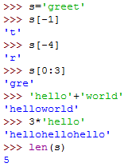

##  数字类型

整数类型（没有取值范围限制）

浮点数类型（没有限制）

复数

**三种类型可以进行相互转换(不支持将复数转换为整数或浮点数)**

int()

float()

complex()

例如：int(4.5)得到结果4

**数据类型的判断**

type(x)

## 字符串类型

用""或''

可以用type来判断一个字符串类型

转义符\

转换成字符串 str(123)

## 元组类型

包含0或多个元素，元素类型均可，定义后不可修改

元组的元素可以是元组，但是这个元素需要（）

## 列表类型

有序，可索引，每个类型可不一样，定义后可修改

## math库

## random库

## 循环

for i in weeks:

while <conditions>:

