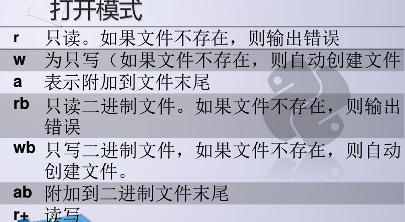
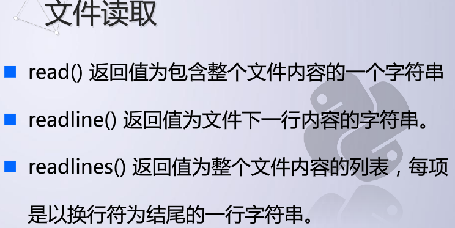
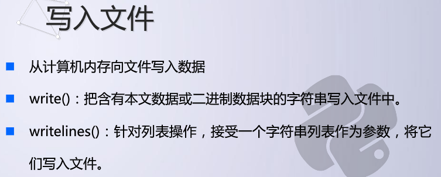
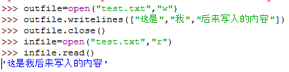
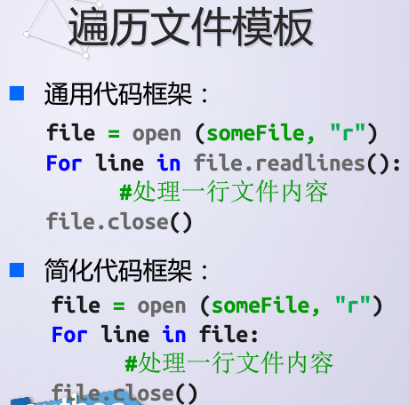
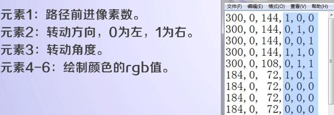
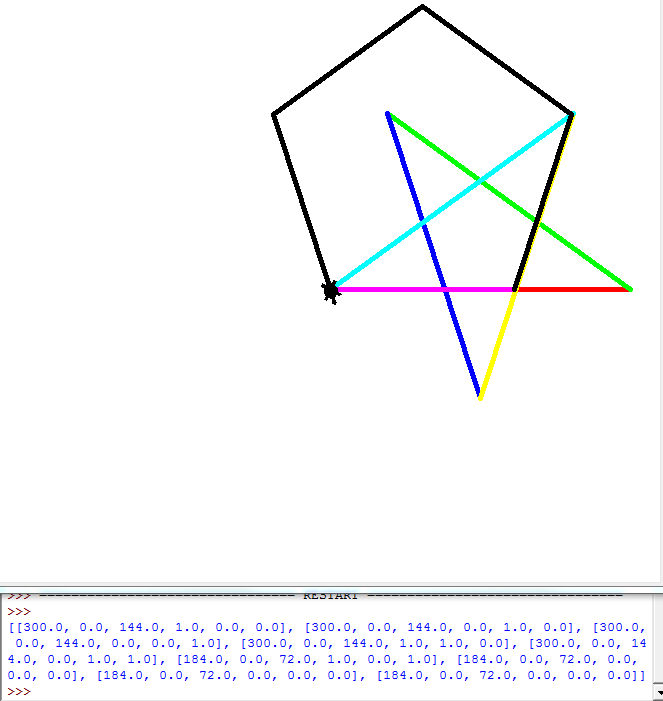

## 打开文件

open()

< variable> = open(< name>,< mode>)

<name>是磁盘上的文件名

<mode>是打开模式

例如：infile = open("music.mp3","rb")

## 文件操作

读取

写入

这个会覆盖文件中之前有的内容（它不是追加，是重新覆盖地写）

定位

其他：追加、计算等

## 关闭文件

## 文件 与turle库的结合  实例一

结果：

## 文件 实例二

合并两个文件

